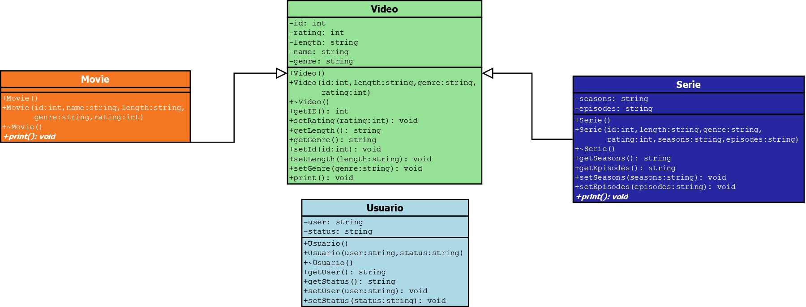

# Proyecto servicio de streaming

## Por: Armando Arredondo Valle

## Descripción del proyecto

Este programa simula un servicio de streaming el cual posee 4 clases, en las cuales se aloja la clase padre (Video), la cual aloja los  atributos de nombre, id, género, duración, así como la calificación.

---

## **Diagrama UML**



---

## **Puntos a cubrir**

---

|  **Propiedad** | **Archivo (s)** | **Descripción** |
| --- | --- | --- |
| Herencia | - Padre (Video) - Hijos(Movie,Serie,Episodes) | Tenemos como clase padre Video, la cual está heredando los atributos así como una función virtual para impresión a las demás clases, esto con el fin de que se cumpla el concepto básico de herencia.|
| Polimorfismo | main | Se hace uso de los punteros en la parte del main con el fin de que se cumpla el polimorfismo, para el llamado a los métodos. |
|Sobrecarga|main , Usuario.cpp/h | Se hace uso de la sobrecarga para imprimir el nombre de usuario de quien esté utilizando el servicio de streaming.
---

## Uso de la herencia

Hago uso de la herencia para heredar los mismos atributos de Video a las demás clases, esto con el fin de tener un cierto ahorro de trabajo / más escritura de líneas de código.

```c++
class Movie : public Video{
    // Aquí hacemos uso de la herencia de Video a Movie con el fin de tomar las variables públicas en Video
};
```

---

## **Uso del polimorfismo**

---

Utilizamos polimorfismo con el fin de tener métodos diferentes de impresión, tal es el caso de el print que tiene un diverso número de repeticiones a lo largo del documento.

### **.h donde se inicializa el polimorfismo.**

```c++
class Video{
    public:
        virtual void print(); // Aquí tenemos de forma virtual en el .h de video, al nosotros realizar la parte de la herencia en otros archivos podemos utilizar este método de forma personalizada según se adecue a nuestras necesidades.
};
```

---

## **Sobrecarga**

---

### **Uso de la sobrecarga:**

Se está haciendo uso de la sobrecarga para mostrar el usuario en pantalla, esto ya que en cualquier servicio de streaming es necesario que se despliegue el mismo para poder tener presente quién está viendo qué.

**.h  donde se inicializa la sobrecarga.**

```c++
    // Con esto determinamos la  sobrecarga para imprimir los datos del usuario.
    friend ostream& operator<<(ostream& os, const Usuario& u);

```

**.cpp donde se inicializa la sobrecarga.**

```c++
    // Aquí sobrecargamos la impresión del usuario y el status de su cuenta
    ostream &operator<<(ostream &os, const Usuario &u)
    {
    os << "Usuario: " << u.user << "\n" << " Status: " << u.status << "\n";
    return os;
    }
```

---

## **Casos de prueba**

1) Caso A:  
   Mostrar el catálogo de películas y series.

```c++
    Usuario: Armando
     Status: Premium
    "-------------------------------------------"
    "|                                         |"
    "|                                         |"
    "|                                         |"
    "|       Welcome to the Video Library!     |"
    "|                                         |"
    "|                                         |"
    "-------------------------------------------"
    "Please select one of the following options:"
    "   [1] View all the catalogue"
    "   [2] Watch a movie"
    "   [3] Watch a serie"
    "   [4] Show movies based on rating"
    "   [5] Show series based on rating"
    "   [6] Rate a movie or a serie"
    "   [0] Exit"
    "Please enter an option: "

```

**Input:**

```c++
    1
```

**Output:**

```txt
                        Movies
[1] The Matrix
[2] Inception
[3] The Darknight
[4] Interestellar
[5] Minions
                        Series
[1] Game Of Thrones
[2] The BigBang Theory 
[3] Breaking Bad
[4] The Walking Dead
[5] The Simpsons  


Please wait while we return to the menu...
```

---

1) Caso B:  
   Ver una película.

**Output:**

```c++
    Usuario: Armando
     Status: Premium
    "-------------------------------------------"
    "|                                         |"
    "|                                         |"
    "|                                         |"
    "|       Welcome to the Video Library!     |"
    "|                                         |"
    "|                                         |"
    "-------------------------------------------"
    "Please select one of the following options:"
    "   [1] View all the catalogue"
    "   [2] Watch a movie"
    "   [3] Watch a serie"
    "   [4] Show movies based on rating"
    "   [5] Show series based on rating"
    "   [6] Rate a movie or a serie"
    "   [0] Exit"
    "Please enter an option: "

```

**Input:**

```c++
    2
```

**Output:**

```txt
                        Movies
[1] The Matrix
[2] Inception
[3] The Darknight
[4] Interestellar
[5] Minions


Please choose a movie to watch: 
```

**Input:**

```c++
    1
```

**Output:**

```txt
Movie: The Matrix
 Id: 1
 Length 2h
 Genre: Sci-Fi
 Rating: 3
Please wait while we return to the menu...
```
---

3) Caso C:  
   Ver una serie.

**Output:**

```c++
    Usuario: Armando
     Status: Premium
    "-------------------------------------------"
    "|                                         |"
    "|                                         |"
    "|                                         |"
    "|       Welcome to the Video Library!     |"
    "|                                         |"
    "|                                         |"
    "-------------------------------------------"
    "Please select one of the following options:"
    "   [1] View all the catalogue"
    "   [2] Watch a movie"
    "   [3] Watch a serie"
    "   [4] Show movies based on rating"
    "   [5] Show series based on rating"
    "   [6] Rate a movie or a serie"
    "   [0] Exit"
    "Please enter an option: "

```

**Input:**

```c++
    3
```

**Output:**

```txt
                        Series
[1] Game Of Thrones
[2] The BigBang Theory
[3] Breaking Bad
[4] The Walking Dead
[5] The Simpsons


Please choose a serie to watch:
```

**Input:**

```c++
    1
```

**Output:**

```txt
                        Series
[1] Game Of Thrones
[2] The BigBang Theory
[3] Breaking Bad
[4] The Walking Dead
[5] The Simpsons


Please choose a serie to watch: 1

Serie: Game of Thrones
 Id: 1
 Seasons: 1 season
 Genre: Fantasy
 Rating: 1
Please choose a season:
```

**Input:**

```c++
    1
```

**Output:**

```txt
List of episodes:

 Id: 1
Name:The tomb of the Dragon
Length: 1h
Rating: 1


 Id: 2
Name:The last of the Night King
Length: 1h
Rating: 4


Please choose an episode:
```

**Input:**

```c++
    1
```

**Output:**

```txt
 Id: 1
Name:The tomb of the Dragon
Length: 1h
Rating: 1

Please wait while we return to the menu...
```

---

4) **Caso D:**  
   Ver películas basadas en un rating.


```c++
    Usuario: Armando
     Status: Premium
    "-------------------------------------------"
    "|                                         |"
    "|                                         |"
    "|                                         |"
    "|       Welcome to the Video Library!     |"
    "|                                         |"
    "|                                         |"
    "-------------------------------------------"
    "Please select one of the following options:"
    "   [1] View all the catalogue"
    "   [2] Watch a movie"
    "   [3] Watch a serie"
    "   [4] Show movies based on rating"
    "   [5] Show series based on rating"
    "   [6] Rate a movie or a serie"
    "   [0] Exit"
    "Please enter an option: "
```

**Input:**

```c++
    4
```

**Output:**

```txt
Please enter a rating: 2
```

**Output:**

```txt
Movie: Interestellar
 Id: 4
 Length 2h
 Genre: Sci-Fi
 Rating: 2
Please wait while we return to the menu...
```

---

5) **Caso E:**  
   Ver una serie basada en el rating.

**Output:**

```c++
    Usuario: Armando
     Status: Premium
    "-------------------------------------------"
    "|                                         |"
    "|                                         |"
    "|                                         |"
    "|       Welcome to the Video Library!     |"
    "|                                         |"
    "|                                         |"
    "-------------------------------------------"
    "Please select one of the following options:"
    "   [1] View all the catalogue"
    "   [2] Watch a movie"
    "   [3] Watch a serie"
    "   [4] Show movies based on rating"
    "   [5] Show series based on rating"
    "   [6] Rate a movie or a serie"
    "   [0] Exit"
    "Please enter an option: "
```

**Input:**

```c++
    5
```

**Output:**

```txt
Please enter a rating: 1
```

**Output:**

```txt
Serie: Game of Thrones
 Id: 1
 Seasons: 1 season
 Genre: Fantasy
 Rating: 1
Please wait while we return to the menu...
```

---

6) **Caso F:**  
   Cambiar calificación de una serie o película.

**Output:**

```c++
    Usuario: Armando
     Status: Premium
    "-------------------------------------------"
    "|                                         |"
    "|                                         |"
    "|                                         |"
    "|       Welcome to the Video Library!     |"
    "|                                         |"
    "|                                         |"
    "-------------------------------------------"
    "Please select one of the following options:"
    "   [1] View all the catalogue"
    "   [2] Watch a movie"
    "   [3] Watch a serie"
    "   [4] Show movies based on rating"
    "   [5] Show series based on rating"
    "   [6] Rate a movie or a serie"
    "   [0] Exit"
    "Please enter an option: "
```

**Input:**

```c++
    6
```

**Output:**

```txt
    Usuario: Armando
 Status: Premium


-------------------------------------------
|                                         |
|                                         |
|                                         |
|       Welcome to the Video Library!     |
|                                         |
|                                         |
-------------------------------------------
Please select one of the following options:
   [1] View all the catalogue
   [2] Watch a movie
   [3] Watch a serie
   [4] Show movies based on rating
   [5] Show series based on rating
   [6] Rate a movie or a serie
   [0] Exit

Please enter an option: 6

[1] for rating a movie, [2] for rating a serie
Enter an option:
```

**Input:**

```c++
    1
```

**Output:**

```txt

 These are all the movies and series which are available on the platform:

                        Movies
[1] The Matrix
[2] Inception
[3] The Darknight
[4] Interestellar
[5] Minions


Please choose a movie to rate:
```

**Input:**

```c++
    1
```

**Output:**

```txt
    Please enter a rating:
```

**Input:**

```c++
    2
```

**Output:**

```c++
    Usuario: Armando
     Status: Premium
    "-------------------------------------------"
    "|                                         |"
    "|                                         |"
    "|                                         |"
    "|       Welcome to the Video Library!     |"
    "|                                         |"
    "|                                         |"
    "-------------------------------------------"
    "Please select one of the following options:"
    "   [1] View all the catalogue"
    "   [2] Watch a movie"
    "   [3] Watch a serie"
    "   [4] Show movies based on rating"
    "   [5] Show series based on rating"
    "   [6] Rate a movie or a serie"
    "   [0] Exit"
    "Please enter an option: "
```

**Input:**

```c++
    4
```

**Output:**

```txt
    Please enter a rating:
```

**Input:**

```c++
    2
```

**Output:**

```txt
Movie: The Matrix
 Id: 1
 Length 2h
 Genre: Sci-Fi
 Rating: 2
Movie: Interestellar
 Id: 4
 Length 2h
 Genre: Sci-Fi
 Rating: 2
Please wait while we return to the menu...
```